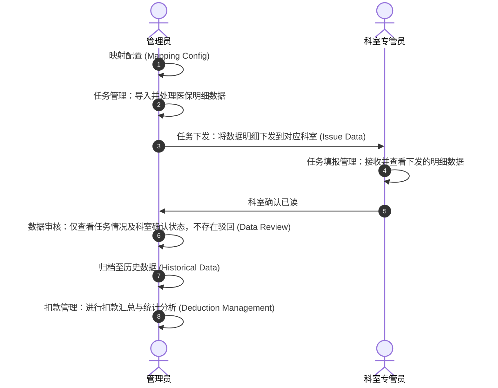
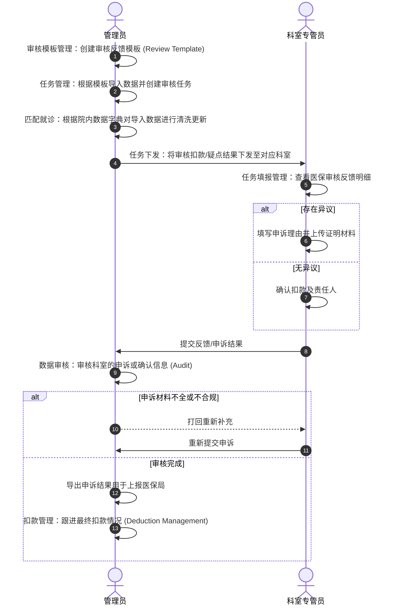

# 系统业务流程图

本文档梳理了该项目系统的主要业务流程，包含**管理员**和**科室专管员**两个角色的交互。根据模板类型的不同，分为“医保明细下发”和“医保审核反馈”两个主要流程。

## 1. 医保明细下发类型业务流程

本流程主要涉及管理员将医保明细数据下发给各科室，由科室专管员进行接收并确认已读，管理员通过数据审核菜单查看任务情况及进行后续管理。

## 2. 医保审核反馈类型业务流程

本流程主要涉及管理员针对医保局的审核结果创建模板与任务，经过“匹配就诊”对数据清洗更新后，下发给科室，科室专管员进行核对、申诉或确认扣款反馈。

